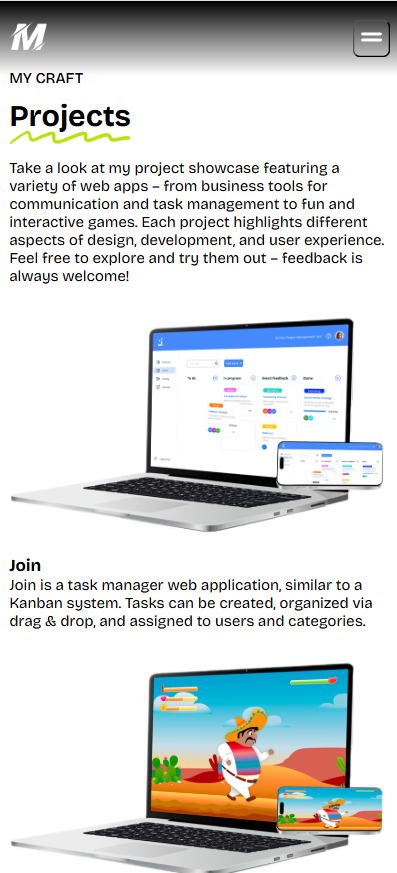
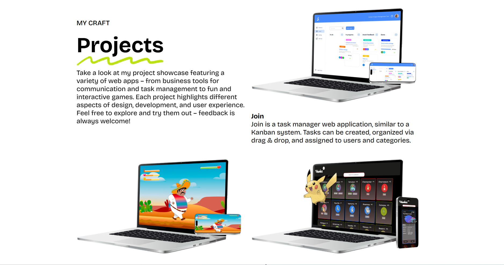

# MyPortfolio

This is my personal portfolio built with Angular 19 to showcase my projects, skills, and professional experience as a developer. The application is modern and fully responsive.

My portfolio website was generated using [Angular CLI](https://github.com/angular/angular-cli) version 19.2.12.

**My Website**: [Let´s check it out](https://michelle-puschkarow.de/)

## 🪄 Features

🧭 Angular 19 – modern Single-Page Application and Routing for easy navigation.

👤 About Me section.

🦾 Tech Stack section.

📅 Project showcase with screenshots, tech stack, and live/demo links.

📒 Contact form (email, php).

📱 Fully responsive design.

⚖️ Impressum & Privacy: A dedicated Impressum page with legal information and privacy details.

## 📸 Screenshots

`Mobile phone preview`<br><br>


`Desktop preview`<br><br>


## ⚙️ Technologies Used

- Angular version 19.2
- TypeScript
- SCSS for styling and animation
- Angular Router
- ngx-translate / Angular TranslateModule for multilingual support (i18n)
- AOS (Animate On Scroll) – scroll-based animations
- Contact form with PHP backend – form data is sent via HTTP to a server-side PHP script
- Hosting on my own domain 

## ⚠️ Disclaimer

This portfolio contains personal content such as:

- Profile photo
- Contact information
- Descriptions of real projects

These elements are **not** licensed for reuse or redistribution.

Feel free to explore the source code for educational purposes, but please **do not publish copies** or host this project under your own name or domain.

If you're looking for a starter template or inspiration, feel free to contact me. Either way you need to **replace all personal content** with your own.

## 🚀 Getting Started

1. Clone the repository.
2. Install dependencies: 
```bash
npm install
```
3. Start the development server:
```bash
ng serve
```
4. Once the server is running, open your browser and navigate to `http://localhost:4200/`. The application will automatically reload whenever you modify any of the source files.

## Additional Resources

For more information on using the Angular CLI, including detailed command references, visit the [Angular CLI Overview and Command Reference](https://angular.dev/tools/cli) page.
   
## 🤓 Author

Created by Michelle Puschkarow. <br>
Graphics © Developer Akademie – used with permission for educational purposes.<br>
If you like this project, feel free to give it a ⭐️ or contribute!

*I hope, you will enjoy.*